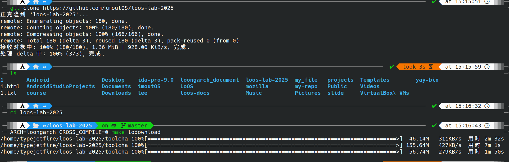
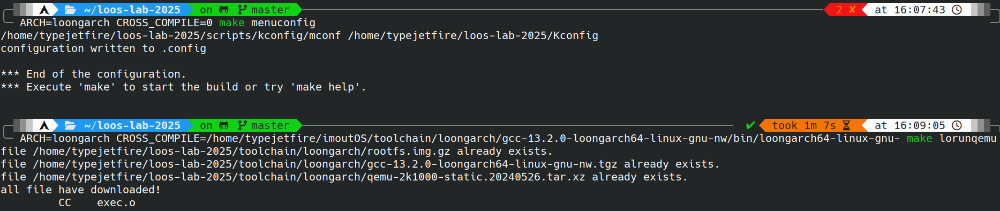
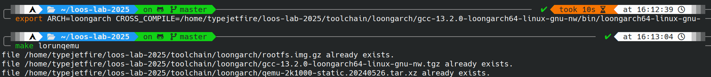

# LoOS lab 2025

## LoOS 开发,运行环境

LoOS 代码和实验发布在 [GitHub](https://github.com/imoutOS/loos-lab-2025)，你可以直接从远程仓库 clone 一份， 也可以 fork 到个人仓库再 clone，fork 成功的仓库设置为 private（私有），防止其他同学浏览你的仓库、抄袭你的代码。LoOS 的实验是一个单人作业，每个同学都有防止抄袭和被抄袭的义务和责任，抄袭行为将会被判 0 分。

```shell
git clone https://github.com/imoutOS/loos-lab-2025
```
或
```shell
git clone <个人仓库url>
```

```shell
cd loos-lab-2025
ARCH=loongarch CROSS_COMPILE=0 make help
ARCH=loongarch CROSS_COMPILE=0 make lodownload
ARCH=loongarch CROSS_COMPILE=0 make menuconfig
ARCH=loongarch CROSS_COMPILE=/home/<username>/loos-lab-2025/toolchain/loongarch/gcc-13.2.0-loongarch64-linux-gnu-nw/bin/loongarch64-linux-gnu- make lorunqemu
```
menuconfig 中将 debug 模式去掉
最后一行运行命令 也可以先设置环境变量，之后每次都只用 make run。
```shell
export ARCH=loongarch CROSS_COMPILE=/home/<username>/loos-lab-2025/toolchain/loongarch/gcc-13.2.0-loongarch64-linux-gnu-nw/bin/loongarch64-linux-gnu- 
make lorunqemu
```




