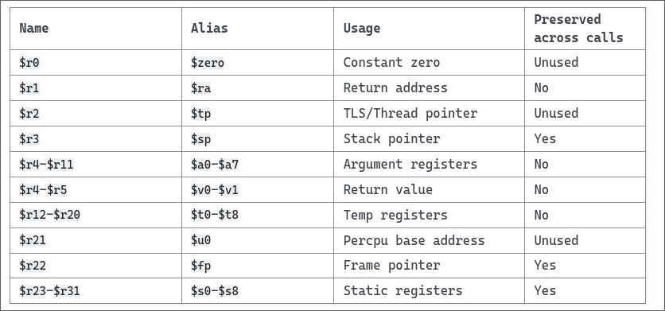

# psABI

## Registers

LoongArch 有 32 个通用寄存器。在 LA32 上它们的长度是 32 bit ，在 LA64
上面它们的长度是 64 bit 。



### 特殊寄存器

* `r0`: hard-wired zero, like in RISC-V
* `r1`: return address
* `r2`: for storing TLS/Thread pointer
* `r3`: stack pointer
* `r21`: Reserved
* `r22`: frame pointer

### caller-saved, callee-saved and arguments

So after the allocation for special registers, the vacancy still is:

* `r4` - `r11`: argument registers and return value
* `r12` - r20`: temp registers ( caller saved )
* `r23` - `r31`: static registers ( callee saved )

因此可以把 r4 到 r11 叫作 a0 到 a7 。（其中 a0 和 a1 是返回值）

把 r12 到 r20 叫作 t0 到 t8 。

把 r23 到 r31 叫作 s0 到 s8 。

???+ tip
    caller saved 表示需要 caller
    来保存，也就是调用前后可能不一样，因此需要在调用子程序之前保存到栈上。 caller
    saved 表示需要 caller 来保存，在调用结束从栈上恢复，也就是保证 调用前后一样。

## Calling Convention

### example

就像在 [RISC-V](../riscv/call.md) 里面一样（包括优化
etc），我们可以用一个示例来验证调用约定。

```c
int add(int a, int b, int c, int d, int e, int f){
    return a + b + c + d + e + f;
}
int main(int argc, char *argv[])
{
    return add(1,2,3,4,5,6);
}
```

```assembly
0000000120000600 <add>:
   120000600:	00101484 	add.w       	$a0, $a0, $a1
   120000604:	00101884 	add.w       	$a0, $a0, $a2
   120000608:	00101c84 	add.w       	$a0, $a0, $a3
   12000060c:	00102084 	add.w       	$a0, $a0, $a4
   120000610:	00102484 	add.w       	$a0, $a0, $a5
   120000614:	4c000020 	jirl        	$zero, $ra, 0

0000000120000618 <main>:
   120000618:	02ffc063 	addi.d      	$sp, $sp, -16(0xff0)
   12000061c:	29c02061 	st.d        	$ra, $sp, 8(0x8)
   120000620:	02801809 	addi.w      	$a5, $zero, 6(0x6)
   120000624:	02801408 	addi.w      	$a4, $zero, 5(0x5)
   120000628:	02801007 	addi.w      	$a3, $zero, 4(0x4)
   12000062c:	02800c06 	addi.w      	$a2, $zero, 3(0x3)
   120000630:	02800805 	addi.w      	$a1, $zero, 2(0x2)
   120000634:	02800404 	addi.w      	$a0, $zero, 1(0x1)
   120000638:	57ffcbff 	bl          	-56(0xfffffc8)	# 120000600 <add>
   12000063c:	28c02061 	ld.d        	$ra, $sp, 8(0x8)
   120000640:	02c04063 	addi.d      	$sp, $sp, 16(0x10)
   120000644:	4c000020 	jirl        	$zero, $ra, 0
```

在进入函数体的时候保存 $ra 是非常显然的事情。（用 $ra
来控制函数结束后的跳转方向，比起 x86 系列的 调用约定要更加清晰和安全，当然 x86
作为典型的 CISC 也没这个寄存器数量来 专门分出一个表示返回地址）

另外一个简单的优化就是对于叶子函数可以不用保存 $ra ，因为不用担心调用其他
函数导致 $ra 遭到修改。

然后 a0 到 a5 传参，add 函数中把 a0 到 a5 全部加到 a0 上面。

???+ info
    和 RISC-V 的很像。

可以参考 [计算机体系结构基础](https://foxsen.github.io/archbase/sec-ISA.html#%E8%BF%87%E7%A8%8B%E8%B0%83%E7%94%A8).

## SYSCALLS

下面描述 Linux/LoongArch 的系统调用 ABI .

正如其他新近的架构移植，绝大部分 Linux/LoongArch 系统调用号和参数都复用asm-generic 的定义。
倒是有些值得一提的点。

* 没有 renameat ，请使用 renameat2 。
* 没有 getrlimit 或者 setrlimit ，请使用 prlimit64 。
* 没有 fstat 或者 newfstatat ，只有 statx 。

自己进行系统调用的底层组件应当感知这一事实，如有必要，应自带兼容逻辑。

目前都通过 syscall 0 指令进行系统调用。 尽管当下内核并不检查指令字中的立即数域，
我们仍然强烈建议保持其为零， 这是为了防止未来它被赋予其他语义而造成您的程序产
生非预期结果。 系统调用号应被存放于寄存器 a7 。 如系统调用有参数，这些参数应如
函数调用一般，从 a0 到 a6 按顺序存放。 系统调用返回时， a0 存放返回值， t0-t8
则应被视作被破坏（clobbered）； 其他寄存器的值都保持不变。

具体的系统调用号可以参阅 include/uapi/asm-generic/unistd.h .

## References

[龙芯架构 ELF psABI 规范](https://loongson.github.io/LoongArch-Documentation/LoongArch-ELF-ABI-CN.html)

[1. Introduction to LoongArch — The Linux Kernel documentation](https://docs.kernel.org/arch/loongarch/introduction.html)
