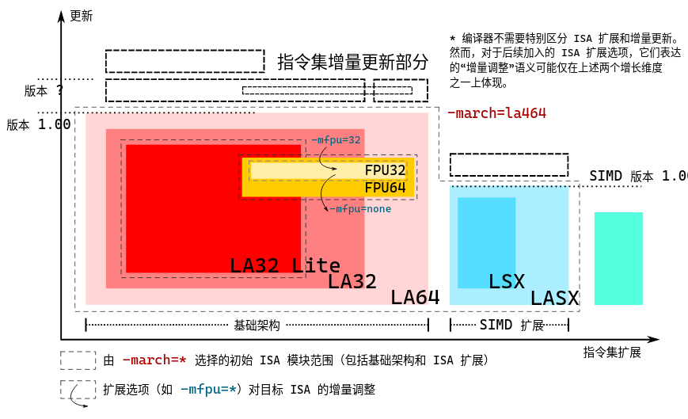
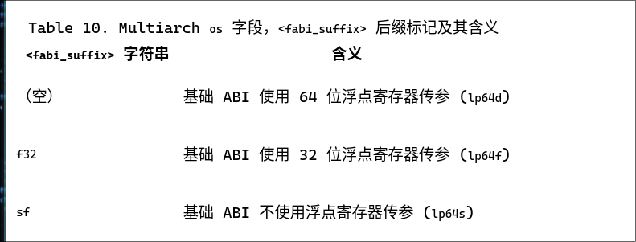
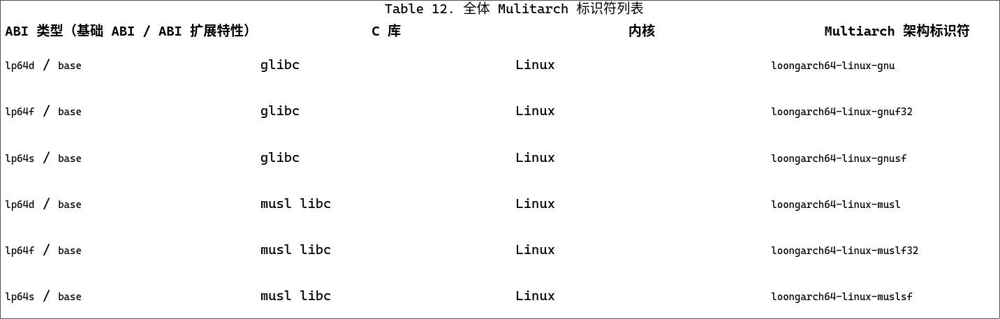

# loongarch 概览

## 称呼

请参阅：[如何称呼龙架构？ | 咱龙了吗？](https://areweloongyet.com/docs/loong-or-loongarch)。在本知识库中遵守以下约定：

* 在需要对龙芯架构做出整体说明时使用 LoongArch 。
* 在需要区分 32 位版本和 64 位版本时使用 LA32 和 LA64 。

## 旧世界和新世界

[旧世界与新世界 |
咱龙了吗？](https://areweloongyet.com/docs/old-and-new-worlds)

## 工具链相关

### GCC

Reference: https://loongson.github.io/LoongArch-Documentation/LoongArch-toolchain-conventions-CN.html

与龙芯架构相关的编译器选项含义包括以下三方面：

* 配置目标架构：允许使用的指令集和寄存器范围；
* 配置目标 ABI：标准数据类型的表示方法，函数调用传参、返回的实现方式；
* 配置优化参数：用于指导编译器优化的微架构特性。

具体到 `loongarch64-unknown-linux-gnu-gcc` ，它有如下几个选项：

* `-march`: valid arguments to `-march=` are: la464 loongarch64 native
* `-mabi` valid arguments to `-mabi=` are: lp64d lp64f lp64s
* `-mtune` valid arguments to `-mtune=` are: la464 loongarch64 native

（在最新发布的 v1.1
[版本](https://github.com/loongson/la-toolchain-conventions?tab=readme-ov-file#list)中，新增了这些项）

其中，`-march` 选择目标架构：设定默认可用的指令集和寄存器范围 （即默认使用的
指令集模块 集合）；`-mabi` 选择目标 ABI 类型；`-mtune` 选择目标微架构：设定微架构相关的性能调优参数。

另外，在浮点数方面也有一些选项：

* `-msoft-float`：禁止使用浮点数指令， 并对当前选择的基础 ABI
  进行调整，以采用软浮点调用惯例。（也就是 lpXs）
* `-msingle-float`：允许使用 32 位浮点数指令， 并对当前选择的基础 ABI
  进行调整，以采用 32 位浮点调用惯例。（也就是 lpXf）
* `-mdouble-float`：允许使用 32 位和 64 位浮点数指令， 并对当前选择的基础 ABI
  进行调整，以采用 64 位浮点调用惯例。（也就是 lpXd）

### ABIs

基本上，LoongArch 的 ABI （6个）可以正交地从两个特性分开：

* Data Model: ILP32 ( LA32 ) / LP64 ( LA64 )
* Float: Soft Float / Single / Double

参见 [../../linux/dev/gcc/#ABI] 部分。

关于 Data Model 可以参见 [我的文章](../../linux/dev/gcc.md/#data-model)；

#### base

如果没有明确 ABI 类型，则为默认的 base 。ABIs 需要
最小架构支持：

* ld64p: la64v100 [fpu64]
* ld64f: la64v100 fpu32
* lp64s: la64v100

### GNU Triplet

关于 Triplet 的详细信息，可以参阅[我的文章](../../linux/dev/gcc.md/#target-triplet)。

#### Triplet machine

machine 字段有两个选择：loongarch64 （对应 LA64）和 loongarch32 （对应 LA32）。

#### Triplet os

#### Possible Triplets for LA64

### Macros

略。见 https://loongson.github.io/LoongArch-Documentation/LoongArch-toolchain-conventions-CN.html

## 工具链构建

### GCC

#### 旧世界

你可以从官方网站提供的 [Binary
文件](http://www.loongnix.cn/zh/toolchain/GNU/) 获取文件。

#### 新世界 - crosstool-ng

伟大的 [Jia Jie](https://jia.je/) 给 ct-ng 贡献了一个构建模板，因此可以直接

> ct-ng loongarch64-unknown-linux-gnu

### QEMU

现在主流的模拟 LoongArch 硬件方法是通过 QEMU .

[这个仓库](https://github.com/foxsen/qemu-loongarch-runenv/) 中包含了一个
开箱即用的 QEMU Binary 。

## References

[龙芯架构工具链约定](https://loongson.github.io/LoongArch-Documentation/LoongArch-toolchain-conventions-CN.html)

[旧世界与新世界（底层细节） | 咱龙了吗？](https://areweloongyet.com/docs/world-compat-details/)

[旧世界与新世界 | 咱龙了吗？](https://areweloongyet.com/docs/old-and-new-worlds)

[如何称呼龙架构？ | 咱龙了吗？](https://areweloongyet.com/docs/loong-or-loongarch)

[基础设施版本基线参考 | 咱龙了吗？](https://areweloongyet.com/docs/baseline-reference)

[龙芯架构 ELF psABI 规范](https://loongson.github.io/LoongArch-Documentation/LoongArch-ELF-ABI-CN.html)

[计算机体系结构基础](https://foxsen.github.io/archbase/)

[loongson/la-toolchain-conventions](https://github.com/loongson/la-toolchain-conventions)

[1. Introduction to LoongArch — The Linux Kernel documentation](https://docs.kernel.org/arch/loongarch/introduction.html)
