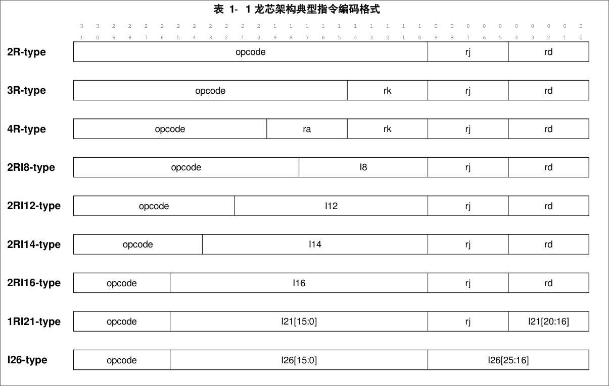

# LA64 / LA32 整数指令

## 约定

### Data Type

* b for bit      (1)
* B for Byte     (8)
* H for Halfword (16)
* W for Word     (32)
* D for Douleword(64)

### 指令格式

## 算术运算

### ADD, SUB, 

## References

[龙芯架构参考手册 - 卷一：基础架构](https://loongson.github.io/LoongArch-Documentation/README-CN.html)

[LoongArch 汇编指令速查 | 咱龙了吗？](https://areweloongyet.com/asmdb)

[1. Introduction to LoongArch — The Linux Kernel documentation](https://docs.kernel.org/arch/loongarch/introduction.html)
