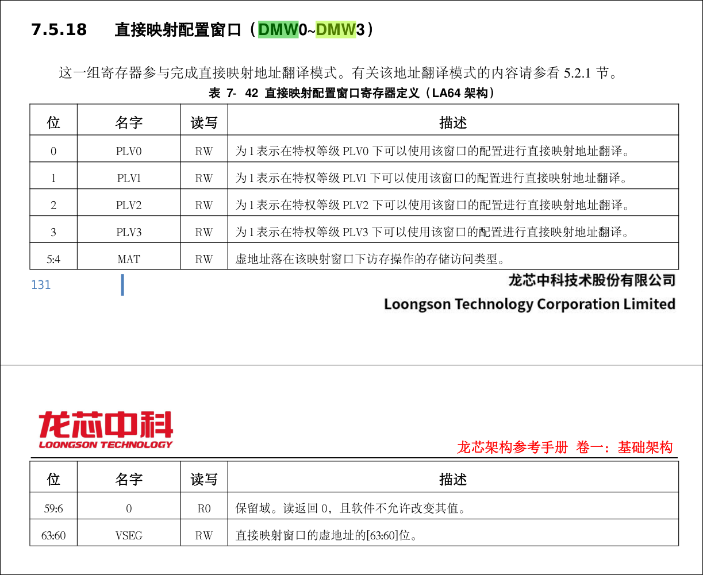
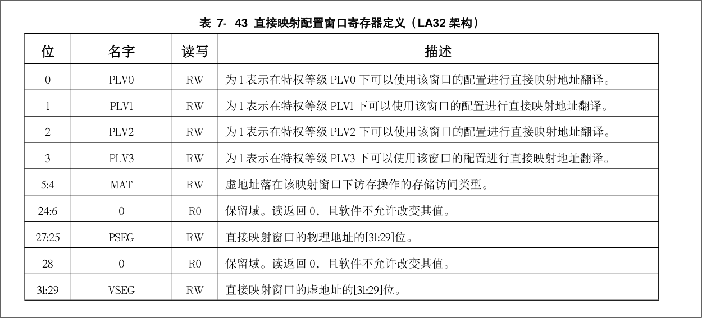

# Memory Management

## Overview

LoongArch 的虚拟内存管理采用软件控制 TLB  ，与 MIPS 类似，当 TLB 查找失败或 TLB 查找成功但有
效位为 0 时，产生对应的 TLB 异常，跳转到异常处理地址进行处理。

而 x86、ARM、RISC-V 都是采用硬件遍历页表方式，软件只需要将页表基地址通过一个 CSR 
告知硬件（如 x86 上的 CR3 、 RISC-V 上的 satp ），硬件完成 TLB 填充。只有当页表遍历发现
页面无效时才产生缺页异常，跳转到异常处理地址进行处理。

因此，在 LoongArch 与 MIPS 一样 没有缺页异常 ，其缺页异常包含在 TLB 异常中，由操作
系统判断是否是缺页。

在 x86、ARM、RISC-V 上没有 TLB 异常。

## 物理地址空间和虚拟地址空间

内存物理地址空间范围是：$0 - 2^{PALEN-1}$ 。 在 LA32 架构下，PALEN 理论上是一
个不超过 36  的正整数，由实现决定其具体的值，通常建议为 32 。 在 LA64 架构下，
PALEN 理论上是一个不超过 60  的正整数，由实现决定其具体的值。 系统软件可以通过
CSR.CPUCFG 读取配置字 0x1 的 PALEN 域来确定 PALEN  的具体值。

龙芯架构的MMU 支持两种虚实地址翻译模式：直接地址翻译模式和映射地址翻译模式。

## 直接地址翻译模式

在 CSR.CRMD.DA = 1 且 PG = 0 时，处理器核的 MMU 处于直接地址翻译模式。 也就是
说，物理地址直接等于虚拟地址的 [PALEN-1:0] 位。可以看到此时整个虚拟地址空间都
是合法的。处理器复位结束后将进入直接地址翻译模式。

（对应了 Intel 上面的实模式）

## 映射地址翻译模式

在 CSR.CRMD.DA = 0 且 PG = 1 时，处理器核的 MMU 处于映射地址翻译模式。具体又分
为直接映射模式和页表映射模式。翻译 地址时将优先看其能否按照直接映射模式进行翻
译，无法进行后再按照页表映射模式进行翻译。这里重点讲述LA64 架构下，采用页表映
射模式时，虚拟地址空间合法性的判定规则：合法虚拟地址的 [63:VALEN] 位必须与
 [VALEN-1] 位相同，即 [VALEN-1] 之上的所有位是其符号扩展，否则将触发地址错（ADE）
例外。然而在直接映射模式下，就不需要进行这种地址非法性检查。

### 直接映射模式

直接映射模式通过直接映射配置窗口机制完成虚实地址翻译，简单来说就是将一大段连续
的虚地址空间线性连续地映射至一段相同大小的物理地址空间。这里被翻译的一整段地址
空间的大小通常远大于页表映射模式下所使用的页的大小，因此需要的配置信息更少。
LoongArch中将一对直接映射关系称为一个直接映射配置窗口，共定义了四个直接映射配
置窗口。四个窗口的配置信息存于CSR.DMW0~CSR.DMW3中，每个窗口的配置信息包含该窗
口对应的地址范围、该窗口在哪些权限等级下可用以及该窗口上的访存操作的存储访问类
型。



#### MAT(5:4)

详见手册 2.1.7 节。

MAT 域的值域存储访问类型的对应关系是：0 —— 强序非缓存，1 —— 一致可缓存，2 ——
弱序非缓存，3 —— 保留。

#### DMW Detailed

举例来说，在 PALEN 等于 48 的情况下，通过将 DMW0 配置为 0x9000000000000011，那
么在 PLV0 级下，0x9000000000000000 ~ 0x9000FFFFFFFFFFFF 这段原本在页映射模式下
不合法的虚地址空间，将被映射到物理地址空间 0x0 ~ 0xFFFFFFFFFFFF 上，且存储访问
类型是一致可缓存的。

（最低位是 0x1 说明只有 PLV0 下可以使用该窗口的配置进行直接映射地址翻译。7:4
为 0x1 说明使用了**一致可缓存**的存储访问类型。）

#### DMW on LA32



> 同时，我们将 CSR.DWM0 寄存器的值设置为 0xa0000001 ，表示 0xa0000000 -
> 0xbfffffff 段 的虚拟地址通过直接映射地址翻译模式映射到 0x00000000 -
> 0x1fffffff 的物理地址。将 CSR.DWM1 寄存器的值设置为 0x80000011 ，表示
> 0x80000000 - 0x9fffffff 段的虚拟地址用 过直接映射地址翻译模式映射到
> 0x00000000 - 0x1fffffff 的物理地址。除了这两段虚拟 地址之外的虚拟地址都是通
> 过页表映射地址翻译模式进行映射。

怎么理解这一段来自[分页机制 - uCore for LoongArch32 Tutorial Book](https://cyyself.github.io/ucore_la32_docs/lab2/paging/)
的话？比起 LA64 中可以选择匹配虚拟地址的前 4 bits, LA32 中只能匹配虚拟地址的前
3 bits ，故会 匹配 0xa = 0b1010 的前 3 bits ，也就是 0xa ~ 0xb .

### Linux/LoongArch 页表结构

我们先抛开 TLB 不谈，在 Linux/LoongArch 中的页表结构是什么样的呢？


首先需要澄清的是，虽然该场景中 VALEN 可能为 48 ，但是实际只有 47 位被用到了。
这是因为 LoongArch 有两个如同 RISC-V 中 matp/satp 的根页表寄存器，它们分别是
PGDH 和 PGDL ，分别在 VA[VALEN-1] （也就是虚拟地址最高位）为 1 和为 0 时为正确
的 PGD 。所以为了方便，我们只使用 VA 的前 47 位。

另外，确实存在 PGD 这个寄存器用来表示正确的 PGD ，但是它是只写的，所以不能直接
赋值。

接着我们分析页表项：

简单计算可知，一个 page 为 16 KiB ，因此可以存 2048 个 PTE （ PTE 的大小为 64
bits ）。一个 page 可以被一个 PPN 唯一确定，因此剩下的可用 bits 数就是 (64 - PALEN + 14) bits 。

分析实际的基本页页表项格式：


下面列出对应域含义以及可能引发的异常：


另外一个需要注意的点是，LoongArch 的页表架构与 RISC-V 不同，RISC-V 在每一层页
表中存储的页表项都是“基本页页表项”，但是 LoongArch 除了最后一层页表存储了
PTE ，其余层次页表中的各项都是直接存储的下一层页表的物理地址。

### TLB Refill vs. Page Fault

首先在其它 ISA 中的 Page Fault 的场景一定会触发 TLB Refill 异常。那么在操作系
统设计中我们可以有两种方案：

* 将 TLB Refill 的处理设计为自动从页表中重填。并在重填后把对应的虚拟地址映射
  到非法物理地址时设置非法页 LOAD 等异常。并用这个来处理真正的 Page Fault。
* 在 TLB Refill 中判断是否是 Page Fault 。

### TLB 自动重填

在访问和控制TLB的控制状态寄存器中，ASID中的ASID域、TLBEHI中的VPPN域、TLBELO0和
TLBELO1中的所有域、TLBIDX中的PS和E域所构成的集合对应了一个TLB表项中的内容（除
了TLB表项中的G位域），ASID中的ASID域、TLBREHI中的VPPN和PS域、TLBRELO0和
TLBRELO1中的所有域所构成的集合也对应了一个TLB表项中的内容（除了G位域和E位域）。
这两套控制状态寄存器都用来完成TLB表项的读写操作，前一套用于非TLB重填异常处理场
景，而后一套仅用于TLB重填异常处理场景。写TLB时把上述寄存器中各个域存放的值写到
TLB某一表项（将TLBELO0和TLBELO1的G位域相与或者将TLBRELO0和TLBRELO1的G位域相与
后写入TLB表项的G位域），读TLB时将TLB表项读到并写入上述寄存器中的对应域（将TLB
表项的G位域的值同时填入TLBELO0和TLBELO1的G位域，或者同时填入TLBRELO0和TLBRELO1
的G位域）。

#### C-Based 方法

#### 汇编方法

LoongArch 提供了 CSR.PWCL 和 CSR.PWCH 两个 CSRs 和 LDDIR, LDPTE 两个指令来辅助
完成自动的 TLB 重填。首先我们假设 PWCL 和 PWCH 共同提供了如下常量：

* PTBASE 末级页表（第0 级页表）的起始地址。
* PTWIDTH 末级页表（第0 级页表）的索引位数。
* DIR1BASE 最低一级目录（第1 级页表）的起始地址。
* DIR1WIDTH 最低一级目录（第1 级页表）的索引位数。
* DIR2BASE 次低一级目录（第2 级页表）的起始地址。
* DIR2WIDTH 次低一级目录（第2 级页表）的索引位数
* PTEWIDTH 内存中每个页表项的位宽。
* DIR3BASE 次高一级目录（第3 级页表）的起始地址。
* DIR3WIDTH 次高一级目录（第3 级页表）的索引位数。
* DIR4BASE 最高一级目录（第4 级页表）的起始地址。
* DIR4WIDTH 最高一级目录（第4 级页表）的索引位数。

> 在Linux/LoongArch64中，当进行三级页表的遍历时，通常用Dir1_base和Dir1_width域
> 来配置页目录表PMD索引的起始位置和位宽，用Dir3_base和Dir3_width域来配置页目录
> 表PGD索引的起始位置和位宽，Dir2_base和Dir2_width域、Dir4_base和Dir4_width域
> 空闲不用。

因此可以给出如下宏定义：

```c
#define DIR1BASE   25
#define DIR1WIDTH  11
#define DIR3BASE   36
#define DIR3WIDTH  11
#define PTBASE     14
#define PTWIDTH    11

#define DIR2BASE   0
#define DIR2WIDTH  0
#define DIR4BASE   0
#define DIR4WIDTH  0
#define PTEWIDTH   0
```

接下来我们看 LDDIR 和 LDPTE 两个指令。

> LDDIR RD, RJ, level(i8)

LDDIR 指令用于在软件页表遍历过程中目录项的访问。

简而言之，该指令会从 CSR.TLBRBADV （也就是存储了触发 TLBR 例外的
仿存虚地址）处按照 level 来进行页表的查找。具体来说，level 决定了需要
查找的是哪一级页表。也就是从以 R[RJ] 为第 level 级页表的（基址）的物理地址，
把通过访存得到的第 level + 1 级的页表（基址）的物理地址放在 R[RD] 中。

level=1 对应CSR.PWCL 中的 PT，level=2 对应CSR.PWCL 中的Dir1，level=3 对应
CSR.PWCL 中的Dir2，level=4 对应CSR.PWCH 中的 Dir3。

> LDPTE RJ, SEQ

该指令用于重填 CSR.TLBRELO 。其中 SEQ 用来指示重填 CSR.TLBRELO0 或 1 。

此时 R[RJ] 应为最后一层页表（也就是 PTE 一层的页表）的物理地址。该指令会自动
从 CSR.TLBRBADV 中获取最后一层页表的索引。

因此按照我们上面的 Linux/LoongArch 的配置，我们可以用下面的汇编来完成 TLBR
的重填管理。

```asm
    csrwr   $t0, CSR_TLBRSAVE
    csrrd   $t0, CSR_PGD
    lddir   $t0, $t0, 3 #访问页目录表PGD
    lddir   $t0, $t0, 1 #访问页目录表PMD
    ldpte   $t0, 0      #取回偶数号页表项
    ldpte   $t0, 1      #取回奇数号页表项
    tlbfill
    csrrd   $t0, CSR_TLBRSAVE
    ertn
```

注：CSR.TLBRSAVE 类似于 RISC-V 中的 M/S SCRACTH，是一个草稿寄存器。

## TLB 详解

### TLB 结构

## References

[1. Introduction to LoongArch — The Linux Kernel documentation](https://docs.kernel.org/arch/loongarch/introduction.html)

[准备知识 - uCore for LoongArch32 Tutorial Book](https://cyyself.github.io/ucore_la32_docs/lab0/prepare/)

[分页机制 - uCore for LoongArch32 Tutorial Book](https://cyyself.github.io/ucore_la32_docs/lab2/paging/)

[虚拟内存 - uCore for LoongArch32 Tutorial Book](https://cyyself.github.io/ucore_la32_docs/lab3/vmm/)

龙芯架构参考手册卷一：基础架构

[第 3 章 特权指令系统 | 计算机体系结构基础](https://foxsen.github.io/archbase/sec-privileged-ISA.html#sec-memory-management)

[存储管理 - rCoreloongArch-tutorial](https://godones.github.io/rCoreloongArch/manage-mem.html)

[多级页表硬件机制 - rCoreloongArch-tutorial](https://godones.github.io/rCoreloongArch/mmu.html)

[SKT-CPUOS/xv6-loongarch-exp](https://github.com/skt-cpuos/xv6-loongarch-exp)

[每周一龙：第 22 期 | 咱龙了吗？](https://areweloongyet.com/newsletter/this-week-in-loongarch-22/)
