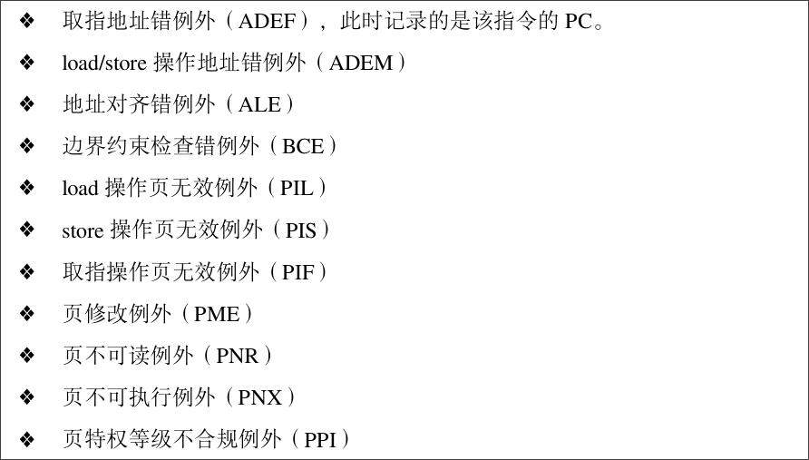

# Privilleged Architecture

## Overview

LoongArch 中处理器核分为 4 个特权等级。（Privilege LeVel, aka PLV）

就如同 Intel 的 Ring0 - Ring3 最后只是简单地用到了 Ring0 （系统态）和
Ring3 （用户态）一样，LoongArch 也只通常只用到 PLV0 （核心态）和
PLV3 （用户态）。

在 [计算机体系结构基础](https://foxsen.github.io/archbase/sec-privileged-ISA.html#%E7%89%B9%E6%9D%83%E6%8C%87%E4%BB%A4%E7%B3%BB%E7%BB%9F%E7%AE%80%E4%BB%8B) 中谈到，通常 ISA 的特权体系架构需要实现下面四个功能。

1. 运行模式定义及其转换。
2. 虚拟内存管理。
3. 异常与中断处理。
4. 控制状态寄存器。

下面依次介绍控制模式寄存器，异常与中断处理，运行模式定义及其转换。
虚拟内存管理单开一章。

## 控制状态寄存器（CSRs）

CSRs
通常位于一个独立的空间，是支撑上面三个机制的实现。内包含一批寄存器，一般用
CSR.XXX 来表示。在 LoongArch 体系架构上面，有如下的 CSRs: 

| 助记符       | 编号          | 说明                            |
| --------- | ----------- | ----------------------------- |
| CRMD      | Ox0         | 处理器当前运行模式及地址翻译模式、全局中断使能等配置信息。 |
| PRMD      | 0x1         | 触发当前普通异常的现场的运行模式及全局中断使能等配置信息  |
| EUEN      | 0x2         | 扩展部件的使能控制                     |
| MISC      | 0x3         | 各权限等级下是否运行使用部分特权指令等杂项配置       |
| ECFG      | 0x4         | 局部中断使能、异常入口间距等配置信息            |
| ESTAT     | 0x5         | 记录异常和中断发生原因                   |
| ERA       | 0x6         | 普通异常处理返回地址                    |
| BADV      | 0x7         | 记录触发地址相关异常的访存虚地址              |
| BADI      | 0x8         | 记录触发异常指令的指令编码                 |
| EENTRY    | 0xC         | 配置普通异常处理程序入口地址                |
| TLBIDX    | 0x10        | 存储管理（TLB）相关寄存器，将在第3节进行详细介绍    |
| TLBEHI    | 0x11        | 存储管理（TLB）相关寄存器，将在第3节进行详细介绍    |
| TLBELO0   | 0x12        | 存储管理（TLB）相关寄存器，将在第3节进行详细介绍    |
| TLBELO1   | 0x13        | 存储管理（TLB）相关寄存器，将在第3节进行详细介绍    |
| ASID      | 0x18        | 存储管理（TLB）相关寄存器，将在第3节进行详细介绍    |
| STLBPS    | 0x1E        | 存储管理（TLB）相关寄存器，将在第3节进行详细介绍    |
| PGDL      | 0x19        | 存储管理（TLB）相关寄存器，将在第3节进行详细介绍    |
| PGDH      | 0x1A        | 存储管理（TLB）相关寄存器，将在第3节进行详细介绍    |
| PGD       | 0x1B        | 存储管理（TLB）相关寄存器，将在第3节进行详细介绍    |
| PWCL      | 0x1C        | 存储管理（TLB）相关寄存器，将在第3节进行详细介绍    |
| PWCH      | 0x1D        | 存储管理（TLB）相关寄存器，将在第3节进行详细介绍    |
| SAVEn     | 0x30+n      | 保存临时数据                        |
| TID       | 0x40        | 恒定频率计时器和定时器相关寄存器              |
| TCFG      | 0x41        | 恒定频率计时器和定时器相关寄存器              |
| TVAL      | 0x42        | 恒定频率计时器和定时器相关寄存器              |
| CNTC      | 0x43        | 恒定频率计时器和定时器相关寄存器              |
| TICLR     | 0x44        | 恒定频率计时器和定时器相关寄存器              |
| LLBCTL    | 0x60        | LLBit的控制                      |
| TLBRENTRY | 0x88        | TLB重填异常处理专用寄存器                |
| TLRBBADV  | 0x89        | TLB重填异常处理专用寄存器                |
| TLBERA    | 0x8A        | TLB重填异常处理专用寄存器                |
| TLBRSAVE  | 0x8B        | TLB重填异常处理专用寄存器                |
| TLBRELO0  | 0x8C        | TLB重填异常处理专用寄存器                |
| TLBRELO1  | 0x8D        | TLB重填异常处理专用寄存器                |
| TLBREHI   | 0x8E        | TLB重填异常处理专用寄存器                |
| TLBRPRMD  | 0x8F        | TLB重填异常处理专用寄存器                |
| MERRCTL   | 0x90        | 由Cache校验错所引发的机器错误异常的相关控制状态寄存器 |
| MERRINFO1 | 0x91        | 由Cache校验错所引发的机器错误异常的相关控制状态寄存器 |
| MERRINFO2 | 0x92        | 由Cache校验错所引发的机器错误异常的相关控制状态寄存器 |
| MERRENTRY | 0x93        | 由Cache校验错所引发的机器错误异常的相关控制状态寄存器 |
| MERRERA   | 0x94        | 由Cache校验错所引发的机器错误异常的相关控制状态寄存器 |
| MERRSAVE  | 0x95        | 由Cache校验错所引发的机器错误异常的相关控制状态寄存器 |
| DMW0~DMW3 | 0x180~0x183 | 直接映射配置窗口0～3的配置寄存器             |
| DBG       | 0x500       | 调试相关的控制状态寄存器                  |
| DERA      | 0x501       | 调试相关的控制状态寄存器                  |
| DSAVE     | 0x502       | 调试相关的控制状态寄存器                  |

### CSR 读写

* CSRRD RD, CSR_NUM
* CSRWR RD, CSR_NUM
* CSRXCHG, RD, RJ, CSR_NUM

CSRRD 可以把 CSR[CSR_NUM] 读到 R[RD] 中；CSRWR 则是把 R[RD] 写到 CSR[CSR_NUM]
中。CSRXCHG 根据 R[RJ] 存放的掩码将 R[RD] 中的值写到 CSR[CSR_NUM] 中
对应写掩码为 1 的那些 bits ，其余 bits 保持不变。同时将该 CSR
的旧值更新到 R[RD] 中。

### CSR Insts Internals

所有CSR 寄存器采用独立的寻址空间。上述指令中CSR 的寻址值来自于指令中的14
比特立即数 csr_num。CSR 的寻址单位是一个CSR 寄存器，即0 号CSR 的csr_num 是0，1
号CSR 的csr_num 是1，以 此类推。 所有CSR 寄存器的位宽要么是32
位，要么与架构中的GR 等宽，因此CSR 访问指令不区分位宽。在 LA32
架构下，所有CSR 自然都是32 位宽。在LA64 架构下，定义中宽度固定为32 位的CSR
总是符号扩展后写入到通用寄存器rd 中的。

References: 手册 4.2.1.1

## 中断/异常机制

按照计算机体系结构基础（3.2.1）中所述，异常可以分为 6 种：

1. 外部事件：来自CPU核外部5的事件，来自处理器内部其他模块或者处理器外部的真实
   物理连线也称为中断。中断的存在使得CPU能够异步地处理多个事件。在操作系统中，
为 了避免轮询等待浪费CPU时间，与IO相关的任务通常都会用中断方式进行处理。中断事
件 的发生往往是软件不可控制的，因此需要一套健全的软硬件机制来防止中断对正常执
行流 带来影响。

2. 指令执行中的错误：执行中的指令的操作码或操作数不符合要求，例如不存在的指令、
   除法除以0、地址不对齐、用户态下调用核心态专有指令或非法地址空间访问等。这些
错 误使得当前指令无法继续执行，应当转到出错处进行处理。

3. 数据完整性问题：当使用ECC等硬件校验方式的存储器发生校验错误时，会产生异常。
   可纠正的错误可用于统计硬件的风险，不可纠正的错误则应视出错位置进行相应处理。

4. 地址转换异常：在存储管理单元需要对一个内存页进行地址转换，而硬件转换表中没
   有有效的转换对应项可用时，会产生地址转换异常。

5. 系统调用和陷入：由专有指令产生，其目的是产生操作系统可识别的异常，用于在保
   护模式下调用核心态的相关操作。

6. 需要软件修正的运算：常见的是浮点指令导致的异常，某些操作和操作数的组合硬件
   由于实现过于复杂而不愿意处理，寻求软件的帮助。

在 LoongArch 中有这些中断/异常：

### 异常/中断表

| 异常代号 | Ecode | Esubcode | 异常说明              | 所属异常类别    |
| ---- | ----- | -------- | ----------------- | --------- |
| PIL  | 0x1   |          | load操作页无效异常       | 地址转换异常    |
| PIS  | 0x2   |          | store操作页无效异常      | 地址转换异常    |
| PIF  | 0x3   |          | 取指操作页无效异常         | 地址转换异常    |
| PME  | 0x4   |          | 页修改异常             | 地址转换异常    |
| PNR  | 0x5   |          | 页不可读异常            | 地址转换异常    |
| PNX  | 0x6   |          | 页不可执行异常           | 地址转换异常    |
| PPI  | 0x7   |          | 页权限等级不合规异常        | 地址转换异常    |
| ADEF | 0x8   | 0x0      | 取指地址错异常           | 指令执行中的错误  |
| ADEM | 0x8   | 0x1      | 访存指令地址错异常         | 指令执行中的错误  |
| ALE  | 0x9   |          | 地址非对齐异常           | 指令执行中的错误  |
| BCE  | 0xA   |          | 边界约束检查错异常         | 指令执行中的错误  |
| SYS  | 0xB   |          | 系统调用异常            | 系统调用和陷入   |
| BRK  | 0xC   |          | 断点异常              | 系统调用和陷入   |
| INE  | 0xD   |          | 指令不存在异常           | 指令执行中的错误  |
| IPE  | 0xE   |          | 指令权限等级错异常         | 指令执行中的错误  |
| FPD  | 0xF   |          | 浮点指令未使能异常         | 系统调用和陷入   |
| SXD  | 0x10  |          | 128位向量扩展指令未使能异常   | 系统调用和陷入   |
| ASXD | 0x11  |          | 256位向量扩展指令未使能异常   | 系统调用和陷入   |
| FPE  | 0x12  | 0x0      | 基础浮点指令异常          | 需要软件修正的运算 |
| VFPE | 0x12  | 0x1      | 向量浮点指令异常          | 需要软件修正的运算 |
| WPEF | 0x13  | 0x0      | 取指监测点异常           | 系统调用和陷入   |
| WPEM | 0x13  | 0x1      | load/store操作监测点异常 | 系统调用和陷入   |
| INT  |       |          | 中断                | 外部事件      |
| TLBR |       |          | TLB重填异常           | 地址转换异常    |
| MERR |       |          | 机器错误异常            | 数据完整性问题   |

???+ info
    RISC-V 中是这样区分异常和中断的：异常可以分为两种：同步异常（指令流同步 eg. 访
    存；Invail OPCODE）；中断（外在设备发出的，与指令流异步）。 因此在 LoongArch
    中，除了“外部事件”, “机器错误”， “CSR硬件修改”算是中断，其余皆算异常。

### 异常/中断相关寄存器表

需要用到的寄存器：

### CSR.EENTRY / 异常处理入口

就像 RISC-V 一样，异常处理入口机制可以分为两种模式：平坦模式和向量化中断模式。

如果 CSR.ECFG.VS 为 0，则为平坦模式，所有普通异常的入口都为 CSR.EENTRY
中的值。如果不为 0 ，则页内偏移为 $ 2^{(VS+2)}\times ecode $ 。

???+ question
    什么是页内偏移？为什么是 $ 2^{(VS+2)}\times ecode $ ？首先，如同我们在上图
    中看到的那样，EENTRY 的最后 10 bits 恒为 0，也就是说，EENTRY 的有效位相当于标
    记了一个页。至于为什么页内偏移为这个形式：向量化中断的最大好处其实就是可以让异
    常处理程序不需要分辨是哪种异常，因为实际上的 ENTRY 至少要与其他 ecode 对应
    的 ENTRY 分隔开至少一条指令长度的距离，也就是 32 bit = 4 byte。 

### CSR.ESTAT / 异常类型判断

ESTAT is for Exception STATus. （异常状态）

下面介绍 CSR.ESTAT 的域。

#### IS

IS(12:0) 位用于表示当前中断状态。

IS(1:0) 用于表示两个软件中断的状态位，IS(0:0) 表示 SWI0 ，IS(1:1) 表示
SWI1 。这两个位有写权限，软件写1 置中断写 0 清中断。

IS(12:2) 分别表示1 个核间中断（IPI），1 个定时器中断（TI），
1 个性能计数器溢出中断（PMI），8 个硬中断（HWI0 - HWI7）。这 11 个位只有
读权限。同样是 1 表示中断置起。

#### ECODE

ECODE(21:16) 用于表示异常一级编码。

#### ESUBCODE

ESUBCODE(30:22) 用于表示异常二级编码。

需要注意的是，如果是TLB 重填例外或机器错误例外，ECODE 和 ESUBCODE 都保持不变。其余情况按照[上表](#_2)处理。

### CSR.ECFG / 异常配置

ECFG is for Exception ConFiG.

#### LIE

LIE is for Local Intrrupt Enables. 

LIE(12:0) 控制了前述 CSR.ESTAT 中的 IS(12:0) 。

局部中断使能位，高有效。这些局部中断使能位与CSR.ESTAT 中IS 域记录的13 个中
断源一一对应，每一位控制一个中断源。

#### VS

VS(18:16) 如在前述 [异常处理入口](#csreentry) 中所说，是用于配置异常处理程序
是平坦模式或者是响亮模式的。

### 其它异常信息寄存器

#### CSR.ERA 

ERA is for Exception Return Address.

在触发异常时，异常处理完毕后的返回地址被存入该 CSR 中。

如果是 TLB 重填异常或者是机器错误异常，保持不变。

#### CSR.BADV

BADV is for BAD Virtual address. 

该寄存器用于触发地址错误相关例外时，记录出错的虚地址。

例外包括：

#### CSR.BADI

BADI is for BAD Instruction.

该寄存器用于记录触发同步类例外的指令的指令码。所谓同步类例外是指除了中断（INT）、客户机
CSR 硬件修改例外（GCHC）、机器错误例外（MERR）之外的所有例外。

## 运行模式定义及转换

CSRs 中有 CSR.CRMD , CSR.PRMD, CSR.TLBRPRMD 来存储模式信息。

以下依次介绍 CSR.CRMD 的各个域。

### PLV

PLV(1:0) 位用于表示当前特权等级。（取值为 0 - 3 时分别表示
PLV0 - PLV3 ）

在执行 ERTN 指令从异常处理程序中返回时，

1. 如果 CSR.ERRCTL.IsMERR = 1，则恢复 CSR.ERRCTL.PPLV
2. 如果 CSR.TLBRERA.IsTLBR = 1，则恢复 CSR.TLBRPRMD.PPLV
3. 其余情况恢复 CSR.PRMD.PPLV

### IE

IE(2:2) 位用于表示当前全局中断是否开启。为 0 时意为屏蔽中断。

触发异常时硬件会自动将其直为 0 ，以确保屏蔽中断。因此在异常处理程序中
需要在完成基本操作后显式将其置为 1 。

在执行 ERTN 指令从异常处理程序返回时，

1. 如果 CSR.ERRCTL.IsMERR = 1，则恢复 CSR.ERRCTL.PIE
2. 如果 CSR.TLBRERA.IsTLBR = 1，则恢复 CSR.TLBRPRMD.PIE
3. 其余情况恢复 CSR.PRMD.PIE

### WE

WE(9:9) 位指定了指令和数据监视点是否开启。为 0 时意味关闭。

触发异常时硬件将其置为 0 。

在执行 ERTN 指令从异常处理程序返回时，

1. 如果 CSR.ERRCTL.IsMERR = 1，则恢复 CSR.ERRCTL.PWE
2. 如果 CSR.TLBRERA.IsTLBR = 1，则恢复 CSR.TLBRPRMD.PWE
3. 其余情况恢复 CSR.PRMD.PWE

至此 PRMD 的三个域全部出现（PPRV, PIE, PWE）。

### 为什么需要为 TLB 重填异常专门设计一套异常处理寄存器组？

> 专用于TLB重填异常处理场景（CSR.TLBRERA的IsTLBR域值等于1）的控制寄存器，其设
> 计目的是确保在非TLB重填异常处理程序执行过程中嵌套发生TLB重填异常处理后，原有
> 异常处理程序的上下文不被破坏。例如，当发生TLB重填异常时，其异常处理返回地址
> 将填入CSR.TLBRERA而非CSR.ERA，这样被嵌套的异常处理程序返回时所用的返回目标就
> 不会被破坏。因硬件上只维护了这一套保存上下文专用的寄存器，所以需要确保在TLB
> 重填异常处理过程中不再触发TLB重填异常，为此，处理器因TLB重填异常触发而陷入异
> 常处理后，硬件会自动将虚实地址翻译模式调整为直接地址翻译模式，从而确保TLB重
> 填异常处理程序第一条指令的取指和访存10一定不会触发TLB重填异常，与此同时，软
> 件设计人员也要保证后续TLB重填异常处理返回前的所有指令的执行不会触发TLB重填异
> 常。

References: https://foxsen.github.io/archbase/sec-privileged-ISA.html#tlb%E7%9B%B8%E5%85%B3%E6%8E%A7%E5%88%B6%E7%8A%B6%E6%80%81%E5%AF%84%E5%AD%98%E5%99%A8

## References

[特权级架构 - rCoreloongArch-tutorial](https://godones.github.io/rCoreloongArch/sup.html)

[1. Introduction to LoongArch — The Linux Kernel documentation](https://docs.kernel.org/arch/loongarch/introduction.html)

龙芯架构参考手册卷一：基础架构
