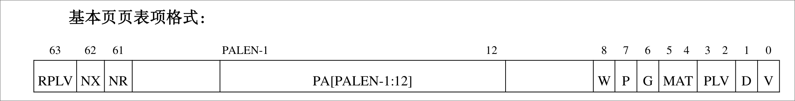

# 内存管理常用宏简介

## CPU/操作系统基本数值

```c
#define PGSHIFT    14
#define PGSIZE     16384
#define VALEN      48
#define MAXVA      1L << 47
#define PALEN      48
#define GRLEN      64
```

以上三个常量分别代表了页内偏移，页表大小，虚拟地址长度，实际上可用的虚拟地址大
小，物理地址大小，通用寄存器长度。

```c
#define PGROUNDUP(sz)  (((sz)+PGSIZE-1) & ~(PGSIZE-1))
#define PGROUNDDOWN(a) (((a)) & ~(PGSIZE-1))
```

上面两个宏可以根据地址和 PGSIZE （向上/向下）对齐。

## 内核地址相关

```c
#define KERNBASE   0x9000000008000000
#define PKERNBASE  0x8000000
#define KMEMSIZE   130*1024*1024
#define PHYSTOP    (PKERNBASE + KMEMSIZE)
```

以上分别代表了：

1. 内核所在的虚拟地址位置。
2. 内核所在的物理地址位置。
3. 内核内存大小。
4. 内核物理地址结束的位置。

## 物理地址/虚拟地址互转


## 页表项

```c
#define PTE_V      1 << 0
#define PTE_D      1 << 1
#define PTE_PLVL   1 << 2
#define PTE_PLVH   1 << 3
#define PTE_PLV    3 << 2
#define PTE_MATL   1 << 4
#define PTE_MATH   1 << 5
#define PTE_G      1 << 6
#define PTE_P      1 << 7
#define PTE_W      1 << 8
#define PTE_NR     1 << 61
#define PTE_NX     1 << 62
#define PTE_RPLV   1 << 63
#define PTE_DEFAULT PTE_V | PTE_MATL | PTE_P | PTE_W
#define PTE_FLAGS(pte) ((pte) & 0xE0000000000001FFUL)
```

以上的 `PTE_XXX` 代表了基本页表项的 flags 。

1. `PTE_DEFAULT` 代表了默认置位。
2. `PTE_FLAGS` 可以从页表项获取该页表项的 flags 。



* V: Vaild 有效位（页无效异常）
* D: Dirty 脏位
* PLV: 特权位（权限等级不合规异常）
* MAT: 存储访问类型
* G: 全局标志位
* P: 物理页存在位
* W: 可写位
* NR: 不可读位
* NX: 不可执行位
* RPLV: 受限特权等级使能

> `P` 和 `W` 两个域分别代表物理页是否存在，以及该页是否可写。这些信息虽然不填入TLB表项中，但用于页表遍历的处理过程。

## 页表项，物理地址与页表查询

```c
#define PAMASK     0xFFFFFFFFFUL << PGSHIFT
#define PTE2PA(pte) (pte & PAMASK)
#define PA2PTE(pa) (((uint64_t)pa) & PAMASK)
```

1. PAMASK: `'1'*36+'0'*PGSHIFT`
2. PTE2PA: 把 PTE 转为物理地址。
3. PA2PTE: 把物理地址转为 PTE 。

因为按照 Linux/LoongArch 的机制，除了最后一层页表存储的是页表项，其余层页表都直接
存储了下一层页表的物理地址。但是 PTE2PA 对于该种场景也适应（因为下一层页表
的物理地址也是对齐整页的）。

```c
#define PXMASK     0x3fff
#define PXSHIFT(level)  (PGSHIFT+(11*(level)))
#define PX(level, va) ((((uint64_t) (va)) >> PXSHIFT(level)) & PXMASK)
#define DMWIN_MASK 0x9000000000000000
```

1. PXMASK: PXMASK 为 0b11111111111 
2. PXSHIFT: PXSHIFT 可以按照 level 将低若干位消去
3. PX: PX 可以按照虚拟地址取第 level 级页表对应的 index 
4. DMWIN_MASK: 设置的 DMW 对应的虚拟地址翻译
